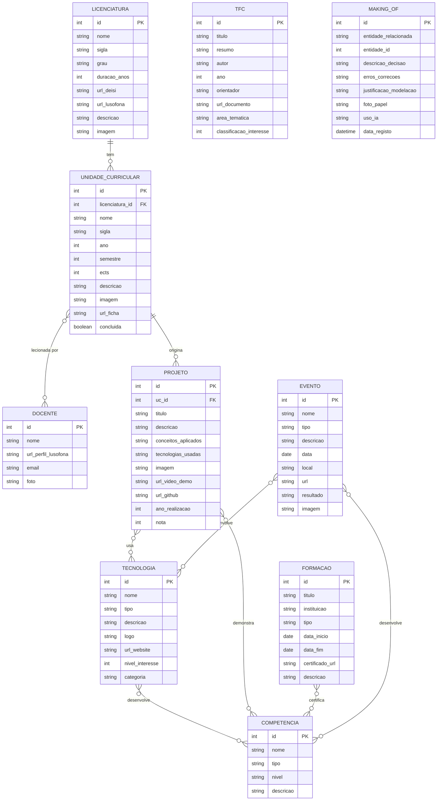

```mermaid
erDiagram
  LICENCIATURA {
    int id PK
    string nome
    string sigla
    string grau
    int duracao_anos
    string url_deisi
    string url_lusofona
    string descricao
    string imagem
  }

  UNIDADE_CURRICULAR {
    int id PK
    int licenciatura_id FK
    string nome
    string sigla
    int ano
    int semestre
    int ects
    string descricao
    string imagem
    string url_ficha
    boolean concluida
  }

  DOCENTE {
    int id PK
    string nome
    string url_perfil_lusofona
    string email
    string foto
  }

  PROJETO {
    int id PK
    int uc_id FK
    string titulo
    string descricao
    string conceitos_aplicados
    string tecnologias_usadas
    string imagem
    string url_video_demo
    string url_github
    int ano_realizacao
    int nota
  }

  TECNOLOGIA {
    int id PK
    string nome
    string tipo
    string descricao
    string logo
    string url_website
    int nivel_interesse
    string categoria
  }

  TFC {
    int id PK
    string titulo
    string resumo
    string autor
    int ano
    string orientador
    string url_documento
    string area_tematica
    int classificacao_interesse
  }

  COMPETENCIA {
    int id PK
    string nome
    string tipo
    string nivel
    string descricao
  }

  FORMACAO {
    int id PK
    string titulo
    string instituicao
    string tipo
    date data_inicio
    date data_fim
    string certificado_url
    string descricao
  }

  MAKING_OF {
    int id PK
    string entidade_relacionada
    int entidade_id
    string descricao_decisao
    string erros_correcoes
    string justificacao_modelacao
    string foto_papel
    string uso_ia
    datetime data_registo
  }

  EVENTO {
    int id PK
    string nome
    string tipo
    string descricao
    date data
    string local
    string url
    string resultado
    string imagem
  }

  LICENCIATURA ||--o{ UNIDADE_CURRICULAR : "tem"
  UNIDADE_CURRICULAR }o--o{ DOCENTE : "lecionada por"
  UNIDADE_CURRICULAR ||--o{ PROJETO : "origina"
  PROJETO }o--o{ TECNOLOGIA : "usa"
  TECNOLOGIA }o--o{ COMPETENCIA : "desenvolve"
  PROJETO }o--o{ COMPETENCIA : "demonstra"
  FORMACAO }o--o{ COMPETENCIA : "certifica"
  EVENTO }o--o{ TECNOLOGIA : "envolve"
  EVENTO }o--o{ COMPETENCIA : "desenvolve"
```